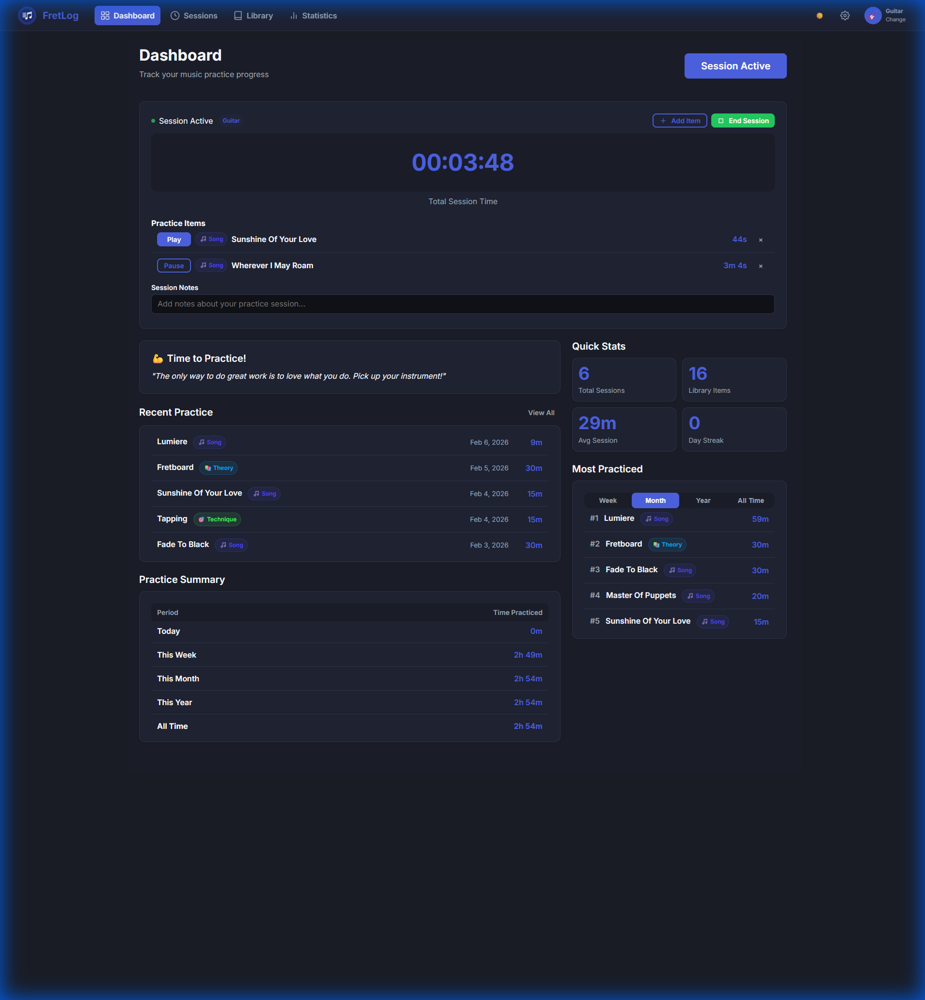
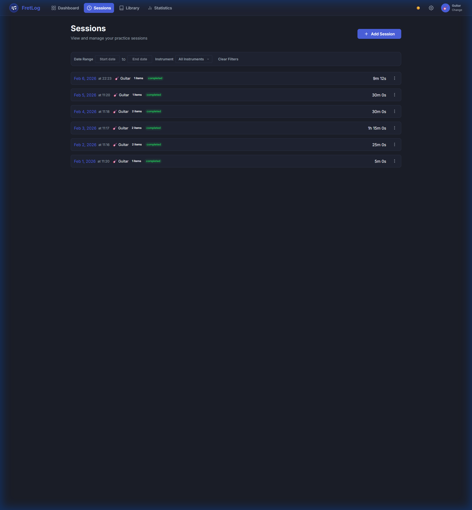
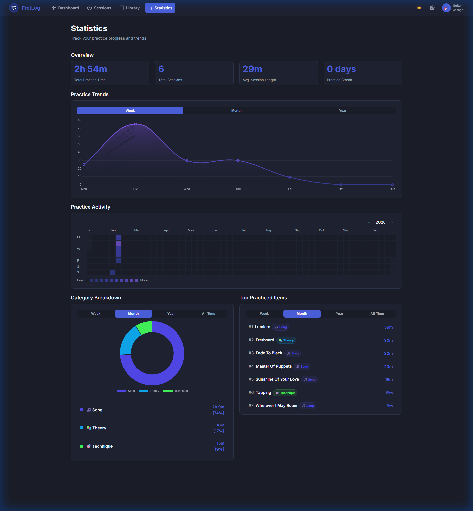
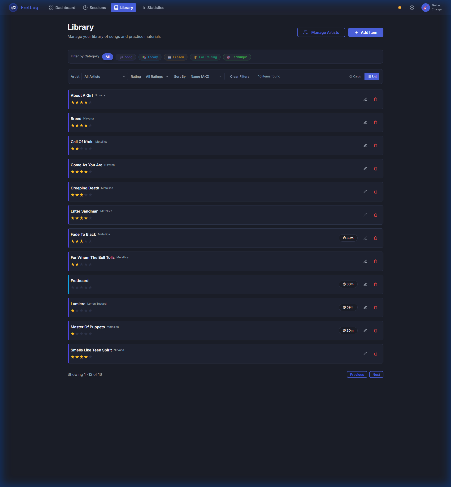

# FretLog 🎸

FretLog is a personal music practice dashboard designed to help musicians track their progress, manage their repertoire, and maintain a consistent practice routine. It combines a minimal practice timer with powerful statistics and visual progress trackers.



## Project Status: Vibe Coded
> [!IMPORTANT]
> This project is **heavily vibe coded** and primarily intended for **personal use**. 
> It was built with a focus on immediate utility and my specific workflow. While functional and feature-rich, it may not follow traditional professional software architecture patterns. It works for me, and it might work for you!

## Key Features
- **📊 Interactive Dashboard**: Quick overview of your practice streak, total time, and recent sessions.
- **⏱️ Active Session Timer**: Start a practice session and track time for specific items in your library with a non-intrusive global timer.
- **📱 PWA Ready**: Install FretLog on your phone or desktop for a native-like experience.
- **📈 Detailed Statistics**: Visualize your progress with GitHub-style activity heatmaps, category distributions, and practice trend charts.
- **📚 Repertoire Library**: Organize your songs, exercises, and techniques with ratings, notes, and artist grouping.
- **🎸 Instrument Management**: Support for multiple instruments (Guitar, Bass, Piano, etc.).
- **☁️ Data Sovereignty**: Full JSON Export/Import capabilities and a single-user SQLite backend for privacy.
- **🌙 Modern UI**: A sleek, dark-mode-first interface optimized for both desktop and mobile use.

## Screenshots

| Dashboard | Sessions |
|:---:|:---:|
|  |  |

| Statistics | Library |
|:---:|:---:|
|  |  |

## Deployment with Docker Compose
The easiest way to run FretLog is using Docker Compose with the pre-built image.

1. **Create a `docker-compose.yml` file**:
   ```yaml
   services:
     fretlog:
       image: ghcr.io/affekopp/fretlog:latest
       container_name: fretlog
       restart: unless-stopped
       ports:
         - "5000:5000"
       environment:
         - DATABASE_PATH=/app/data/fretlog.db
         - FLASK_DEBUG=0
       volumes:
         - ./data:/app/data
   ```

2. **Start the application**:
   ```bash
   docker-compose up -d
   ```

3. **Access FretLog**:
   Open [http://localhost:5000](http://localhost:5000) in your browser.

## Tech Stack
- **Backend**: Python 3.11 (Flask), Gunicorn (Production WSGI)
- **Database**: SQLite3
- **Frontend**: Vanilla JS (Modern ES6+), HTML5, CSS3, Chart.js
- **PWA**: Service Workers (Background caching), Web Manifest
- **Deployment**: Docker, Docker Compose, GHCR, GitHub Actions

## License
Intended for personal use. Feel free to fork and adapt it to your needs.

## Development Checks

Install the pinned Python dependencies and run the regression suite:

```bash
python -m pip install -r requirements.txt
python -m unittest discover -s tests -v
```

The test suite covers API lifecycle behavior, validation, imports, statistics, pagination, page routes, and core PWA assets. GitHub Actions runs it automatically for pushes and pull requests targeting `main`.

Run the Playwright browser checks separately:

```bash
npm install
npx playwright install chromium
npm run test:e2e
```

The browser suite checks desktop and mobile navigation, theme persistence, modal keyboard behavior, focus restoration, PWA registration, practice-session cancellation, timer elapsed time, and critical accessibility violations.
GitHub Actions runs the browser suite automatically for pushes and pull requests targeting `main`.
